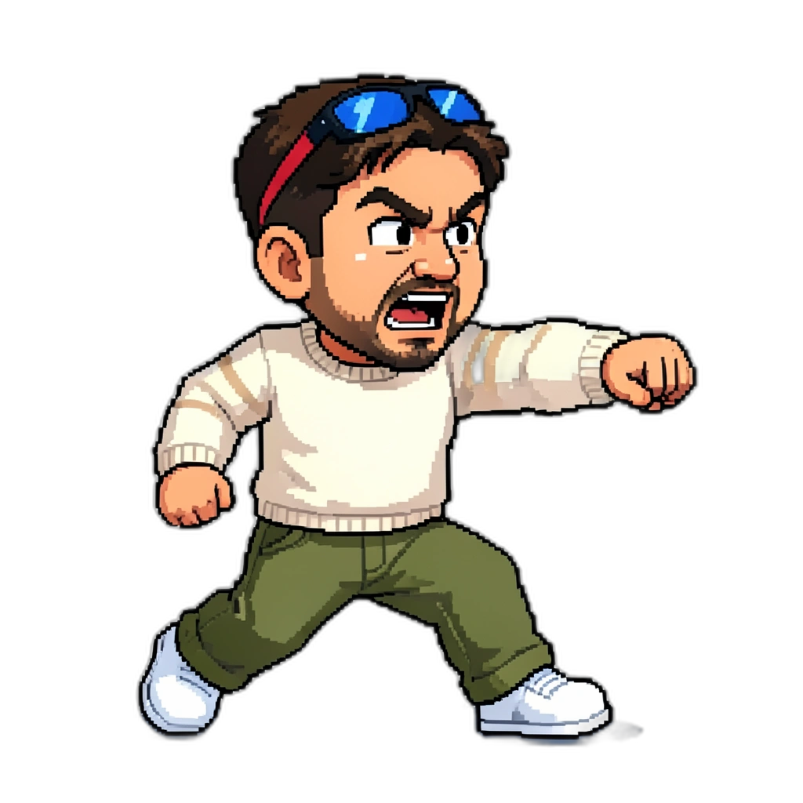
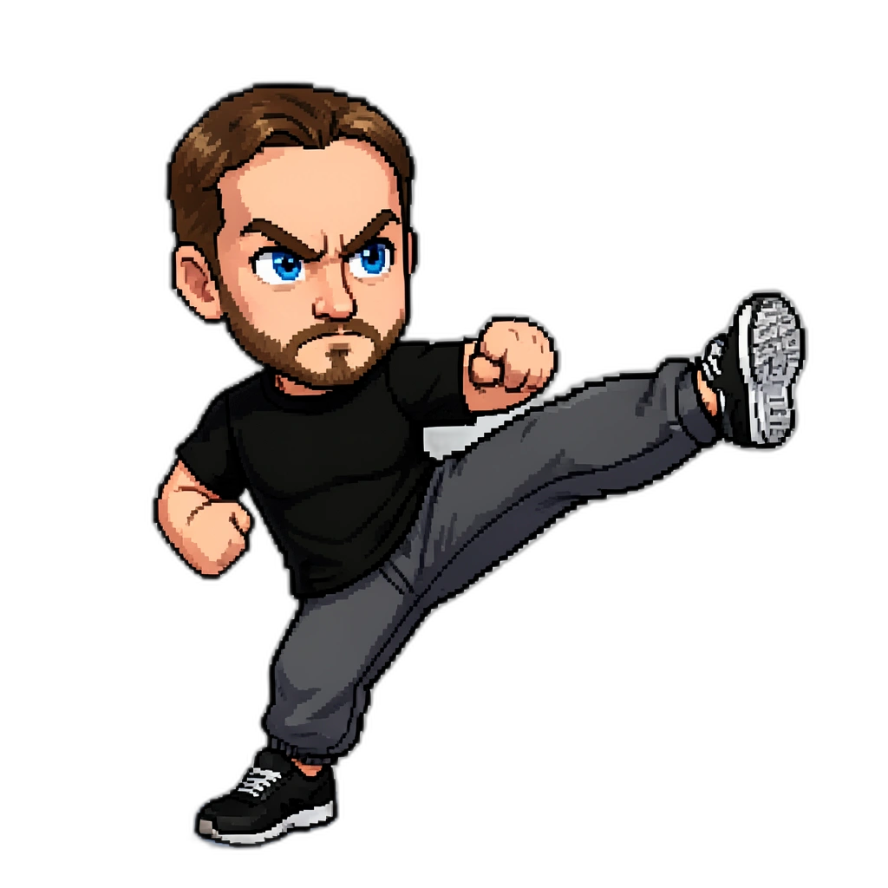

# ⚔️ RADAR FIGHTERS 2 ⚔️

### *La Arena Definitiva de la Oficina — Ahora en las Plataformas*

  

**24 guerreros. 3 vidas. Plataformas. Sin red.**

### [🎮 JUGAR AHORA](https://christiangfv.github.io/radar-fighters-2/)

*Radar Fighters 2 es un Platformer Brawler estilo Super Smash Bros / Brawlhalla. Lanza a tus rivales fuera del escenario, gana vidas, domina las plataformas.*

---

## 🕹️ CONTROLES

### Jugador 1
| Acción | Tecla |
|--------|-------|
| Moverse | `A` / `D` |
| Saltar / Doble salto | `W` o `↑` |
| Golpe normal | `J` |
| Patada | `K` |
| Special | `L` |
| Bloquear | `S` (en suelo) |

### Jugador 2
| Acción | Tecla |
|--------|-------|
| Moverse | `←` / `→` |
| Saltar / Doble salto | `↑` |
| Golpe normal | `Numpad 1` o `U` |
| Patada | `Numpad 2` o `I` |
| Special | `Numpad 3` o `O` |
| Bloquear | `↓` (en suelo) |

**📱 Móvil** — D-Pad + 3 botones de ataque en pantalla.

---

## ⚡ MECÁNICAS

### 💥 Sistema de Daño (estilo Smash Bros)
- Cada personaje empieza en **0%** de daño
- Recibir golpes **sube el porcentaje** (0% → 999%)
- A mayor porcentaje acumulado, **más lejos volaás** al recibir un golpe
- Los personajes con mucho % se pueden KO con ataques moderados

### 🚀 Knockback Dinámico
- Los golpes empujan a los personajes en la dirección del ataque
- `Golpe normal` → knockback suave, ideal para combos
- `Patada` → knockback diagonal con más componente vertical
- `Special` → knockback masivo, lanzamiento potente

### 💀 Vidas (Stocks)
- Cada jugador tiene **3 vidas**
- Un personaje queda KO al salir de los **límites del escenario** (blast zones)
- Al perder una vida, **reaparece desde arriba** con breve invencibilidad
- Gana quien elimine las **3 vidas del rival**

### 🏝️ Plataformas
- Cada escenario tiene **4 plataformas**: suelo + 3 plataformas flotantes
  - 2 plataformas laterales a altura media
  - 1 plataforma central elevada
- Las plataformas tienen **paso desde abajo** (solo colisionan al caer sobre ellas)
- El combate se vuelve tridimensional: controla la altura

### 🦘 Doble Salto
- Primer salto: `W` o `↑` (en suelo)
- Segundo salto: `W` o `↑` (en el aire)
- El doble salto se recarga al tocar cualquier plataforma

### 🛡️ Bloqueo
- `S` (P1) o `↓` (P2) bloquea ataques mientras estás en suelo
- El bloqueo reduce el knockback recibido
- No puedes atacar mientras bloqueas

---

## 🎮 EL ROSTER (24 personajes)

### 👑 Fundadores
**HERBERT** · CEO · ⚔️9 💨6 🛡️6  
**GABO** · CTO · ⚔️8 💨8 🛡️5  
**AMANDA** · CRO · ⚔️8 💨8 🛡️5

### 💻 Ingeniería
**ARTURO** · Tech Manager · **JAIME** · Tech Lead · **CHRIS** · Backend Eng  
**KEVIN** · Full Stack · **LORENS** · Backend · **NELSON** · Backend  
**ANDRÉS** · DevOps · **JAVIER** · Frontend · **GERARDO** · Low Code

### 📊 Producto & Negocio
**CARLO** · Product Lead · **ESTEBAN** · Biz Dev · **FRANCISCO** · Analyst

### 💰 Ventas
**HÉCTOR** · Sales Manager · **ALEX** · Sales Exec

### ⚙️ Ops, Finanzas & People
**DANI** · Ops Analyst · **YONG** · Ops Manager · **GERI** · Accounting · **MAX** · People

### 📣 Marketing & Comms
**ANDY** · Marketing Lead · **KAREN** · Comms Analyst

### 🐬 Jefe Secreto
**RADARÍN** · Chief Culture Officer · ⚔️10 💨10 🛡️10  
*"No es solo la mascota. Es el JEFE FINAL."*

---

## 🗺️ ESCENARIOS

- **Ixtapa** — El clásico de las palmas
- **Valle Bravo** — Vista al lago, fights al atardecer
- **Colchagua** — Entre viñedos y ganchos
- **Zapallar** — La playa más peligrosa de Chile

---

## 🎨 CARACTERÍSTICAS

- 🎭 **24 luchadores** con sprites pixel art personalizados
- 🏝️ **Plataformas flotantes** en cada escenario
- 💥 **Física de knockback** dinámica (escala con el % de daño)
- 🎵 **Música chiptune 8-bit** dinámica por escena
- 📱 **Responsive** — Desktop y móvil
- 🎮 **1P vs IA** o **2P local**
- ⚡ **Cero dependencias** — Vanilla JS puro, sin build step
- 🔊 **Web Audio API** — SFX generados proceduralmente
- ✨ **Efectos** — Partículas, screen shake, invencibilidad al respawn

---

## 🚀 JUGAR

**Online:** [christiangfv.github.io/radar-fighters-2](https://christiangfv.github.io/radar-fighters-2/)

**Local:**
```bash
git clone https://github.com/christiangfv/radar-fighters-2.git
cd radar-fighters-2
npx serve .
```

Sin `npm install`. Sin webpack. Sin drama.

---

## 🛠️ STACK

- **PixiJS 8** — Renderizado WebGL/Canvas
- **Web Audio API** — Música chiptune + SFX procedural
- **Vanilla JS** — Lógica del juego (~1900 líneas)
- **HTML5 + CSS3** — Cero frameworks

---

## 📜 CHANGELOG

### v2.0 — Platformer Brawler
- ✅ Sistema de daño porcentual (0%–999%) estilo Smash Bros
- ✅ Knockback dinámico que escala con el daño acumulado
- ✅ Sistema de vidas/stocks (3 por jugador)
- ✅ KO por salir de los límites del escenario (blast zones)
- ✅ Reaparición desde arriba con invencibilidad temporal
- ✅ Doble salto para todos los personajes
- ✅ 4 plataformas por escenario (suelo + 3 flotantes)
- ✅ Paso a través de plataformas desde abajo
- ✅ Cámara con zoom dinámico según separación de personajes
- ✅ Nuevos controles simplificados: J=golpe, K=patada, L=special

### v1.0 — Street Fighter Original
- Sistema HP + best of 3 rounds
- 6 botones de ataque (LP/MP/HP/LK/MK/HK)

---

  

*Elige tu luchador. Vuela a tu rival fuera del escenario. Hazlo otra vez.*

Hecho con 💪, ☕ y física de Smash Bros por el equipo de [Radar](https://radar.cl)

**© 2026 RADAR FIGHTERS 2** — *Todos los derechos reservados para darte knockback*
